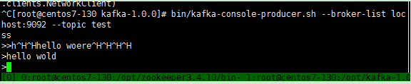
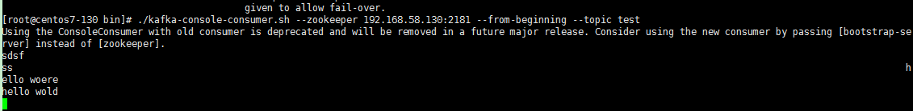

# kafka 配置步骤

## 1，kafka 必须要在zookeeper上运行，首先启动zookeeper  或采用集群或单机均可

### 采用集群测试

  分别在三台虚拟机上安装好zookeeper 并配置好集群  分别 192.168.58.130 192.168.58.131 192.168.58.132 

## 2,设置kafka配置 在  kafka-1.0.0/config 中 server.properties

   说明几点：

### 设置日志目录

>  1，log.dirs=/opt/zkinfo/kafkainfo/kafka-logs  

### 设置zookeeper 服务器及端口

>   2，zookeeper.connect=192.168.58.130:2181,192.168.58.131:2181,192.168.58.132:2181 

### 日志的保存时间

   ===============以下2点默认=============================

> 3，log.retention.hours=24

### 日志大小

>   4，log.retention.bytes=1073741824

其他默认

## 3,启动kafka服务

### 启动：

   bin/kafka-server-start.sh -daemon config/server.properties

### 停止：

   bin/kafka-server-stop.sh

## 4,查看已经创建的topic列表：

  bin/kafka-topics.sh --list --zookeeper 192.168.58.130:2181

## 5,创建topic：

  bin/kafka-topics.sh --create --zookeeper 192.168.58.130:2181 --replication-factor 1 --partitions 1 --topic test

###  说明： 注意 --replication-factor 1  此中间有空格

  --replication-factor 1  复本数
  --partitions 1  分区数

##  6,查看topic明细：

  bin/kafka-topics.sh --describe --zookeeper 192.168.58.130:2181 --topic test

###  向topic test发数据 即生产者

 [root@centos7-130 kafka-1.0.0]# bin/kafka-console-producer.sh --broker-list localhost:9092 --topic test

##  7,接收端接收数据

 [root@centos7-130 bin]# ./kafka-console-consumer.sh --zookeeper 192.168.58.130:2181 --from-beginning --topic test

